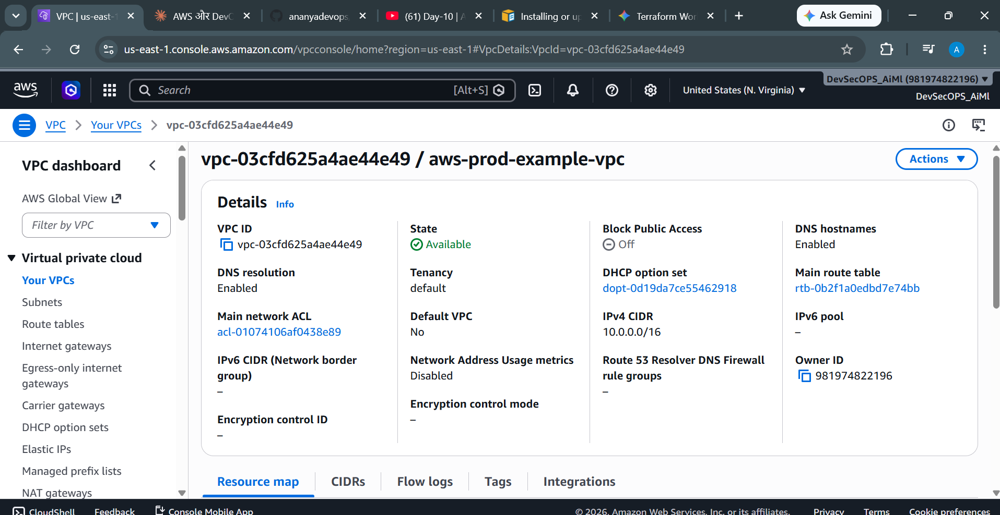
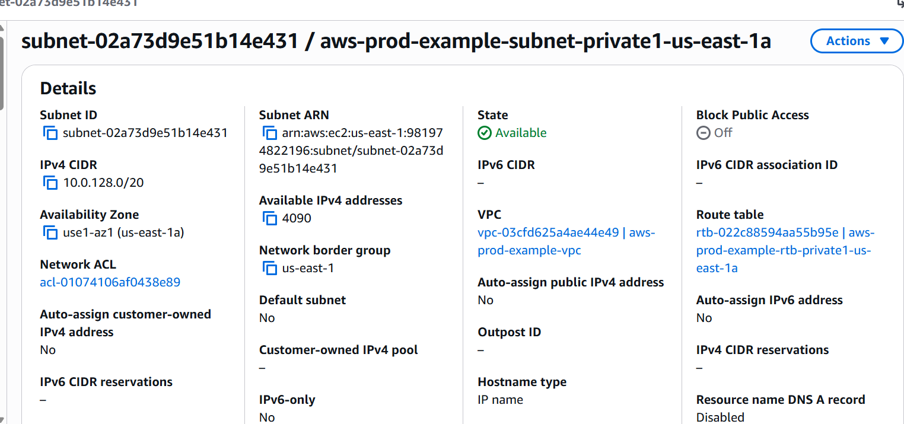
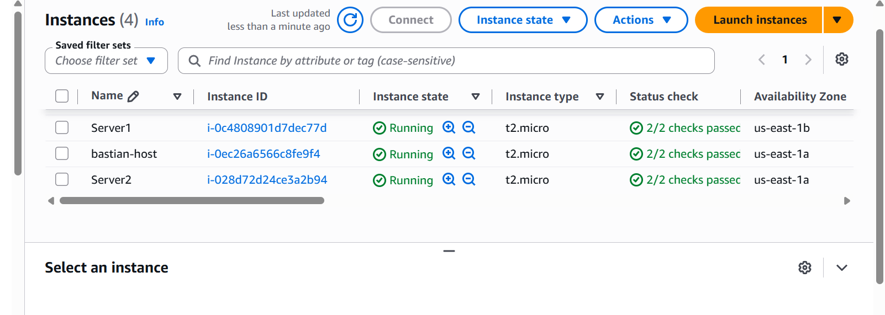
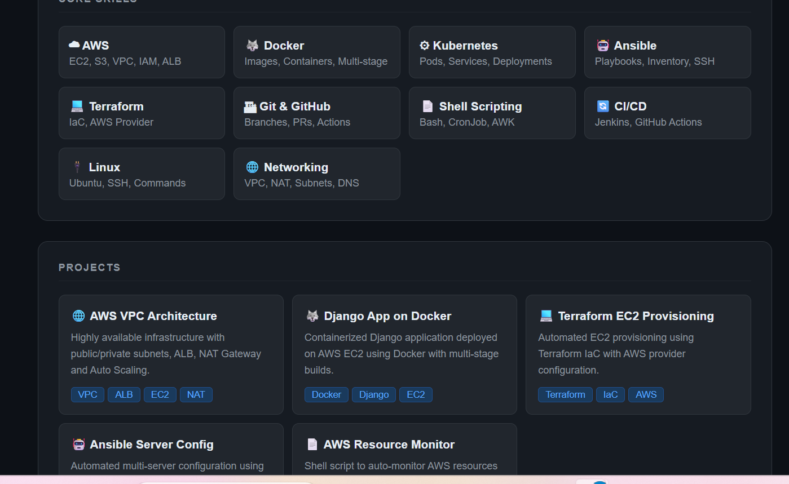

# AWS Highly Available VPC Architecture 🏗️

## Overview
Production-ready highly available AWS infrastructure 
built from scratch using AWS Console.

## Architecture Diagram

## Architecture Components
- ✅ VPC (10.0.0.0/16)
- ✅ 2 Public Subnets (us-east-1a, us-east-1b)
- ✅ 2 Private Subnets (us-east-1a, us-east-1b)
- ✅ Internet Gateway
- ✅ NAT Gateway (2 AZs)
- ✅ Route Tables
- ✅ Application Load Balancer
- ✅ Auto Scaling Group
- ✅ EC2 Instances in Private Subnets
- ✅ Security Groups

## Screenshots

## Key Concepts Used
- High Availability across 2 AZs
- Private subnets for enhanced security
- NAT Gateway for outbound internet access
- Load Balancer for traffic distribution
- Auto Scaling for handling traffic spikes

## Tech Stack
`AWS VPC` `EC2` `ALB` `Auto Scaling` `NAT Gateway` `Route Tables` `Security Groups`
